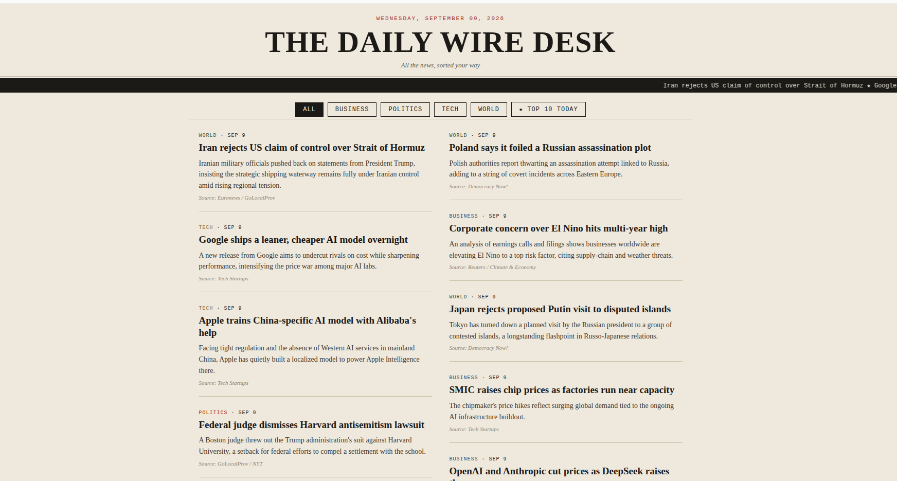
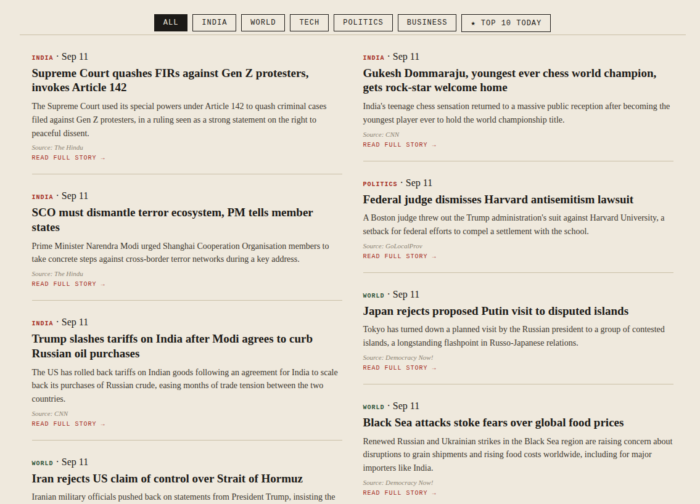
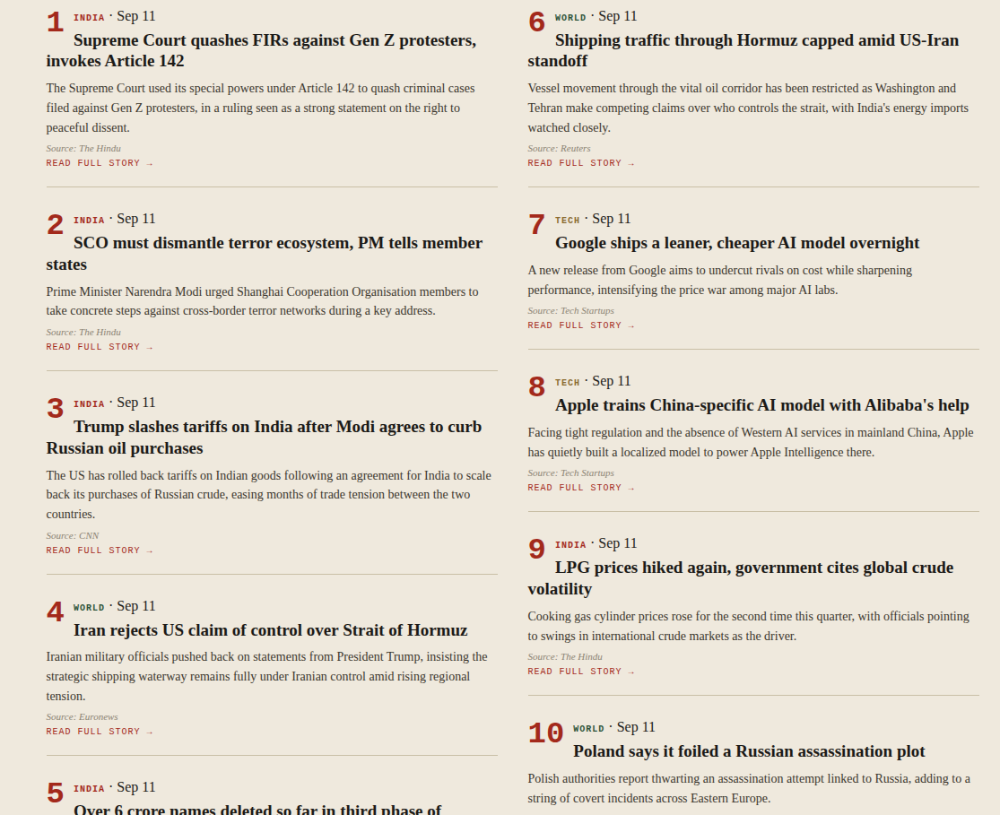
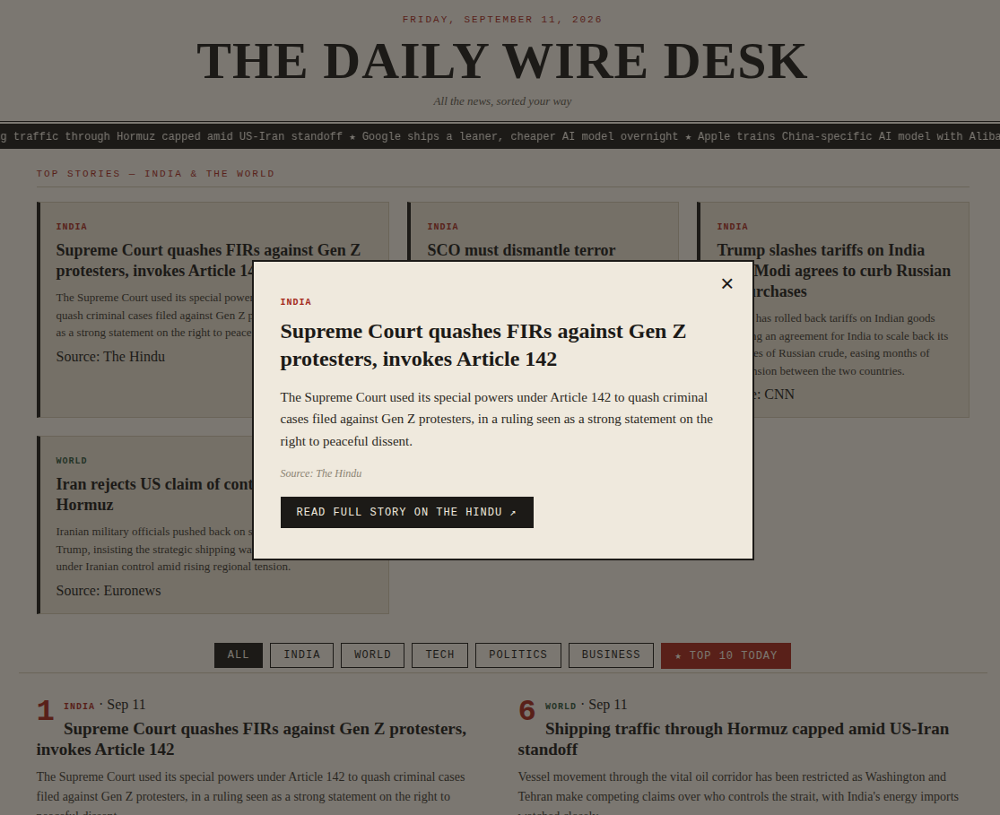
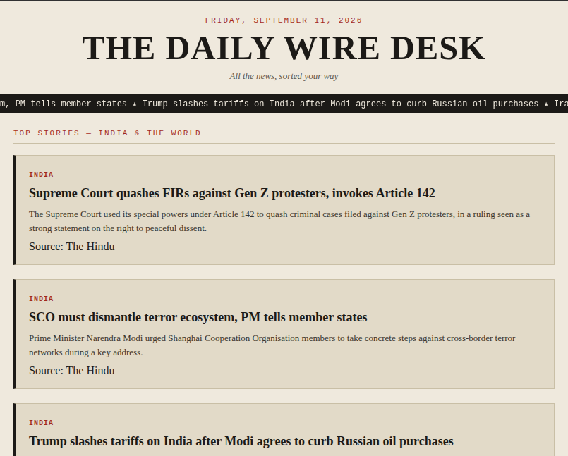

<div align="center">

# 📰 The Daily Wire Desk

**A print-style daily news web app — colorful categories, clickable stories, and a Top 10 Today view.**


[Features](#-features) • [Demo](#-demo) • [Quick Start](#-quick-start) • [Project Structure](#-project-structure) • [Customize](#-customize-the-news) • [Deploy](#-deploy)

</div>

---

## ✨ Features

- 🗞️ **Print-newspaper design** — masthead, scrolling ticker, serif type
- 📡 **Live news** — pulls real headlines from public RSS feeds (no API key needed), auto-refreshes hourly
- 🇮🇳 **Hero section** — top India & world stories featured up front
- 🖱️ **Clickable stories** — click any card to open the full story in a modal, with a link to the original source
- 🏷️ **Category filters** — India, World, Tech, Politics, Business
- ⭐ **Top 10 Today** — ranks and numbers the day's biggest stories
- 🔌 **Simple data layer** — all news lives in one auto-generated `stories.json`

---

## 📸 Demo

<details open>
<summary><b>🏠 Home page — masthead, ticker, hero stories</b></summary>
<br>



</details>

<details>
<summary><b>🗂️ Category filter in action</b></summary>
<br>



</details>

<details>
<summary><b>⭐ Top 10 Today view</b></summary>
<br>



</details>

<details>
<summary><b>📖 Story modal — click any card to read more</b></summary>
<br>



</details>

<details>
<summary><b>📱 Mobile view</b></summary>
<br>



</details>

> Drop your own screenshots into `project-demo/` using the filenames above and they'll show up here automatically on GitHub.

---

## 🚀 Quick Start

```bash
git clone https://github.com/YOUR_USERNAME/YOUR_REPO.git
cd daily-wire-desk
pip install -r requirements.txt
python app.py
```

Then open **http://localhost:5000** 🎉

---

## 🗂️ Project Structure

```
daily-wire-desk/
├── app.py                  # Flask routes + API + starts live-news scheduler
├── fetch_news.py           # 📡 pulls live headlines from RSS feeds
├── stories.json            # auto-generated news data (fallback if a fetch fails)
├── templates/
│   └── index.html          # page template
├── static/
│   ├── style.css           # newspaper theme
│   └── app.js               # filtering, ticker, modal logic
├── project-demo/           # screenshots for this README
├── requirements.txt
├── Procfile
└── README.md
```

---

## 📡 Live News

News comes from public RSS feeds — no API key or signup required. On startup, `app.py` calls `fetch_news.py`, which pulls the latest headlines and rewrites `stories.json`. It then refreshes automatically every hour while the app is running.

**Feeds used** (edit the `FEEDS` dict in `fetch_news.py` to add/remove sources):

| Category | Sources |
|---|---|
| India | Times of India, NDTV |
| World | BBC World, Reuters World |
| Tech | TechCrunch |
| Business | BBC Business |
| Politics | BBC Politics |

**Manual refresh** without restarting the server:
```bash
curl -X POST http://localhost:5000/api/refresh
```

**Manual refresh** from the command line, no server needed:
```bash
python fetch_news.py
```

If a feed is unreachable (no internet, feed down), the app keeps whatever was last saved in `stories.json` instead of breaking.

---

## ✍️ Customize the News

All content is fetched live via RSS (see [Live News](#-live-news) above). To manually override or add a story, edit `stories.json` directly — it'll get overwritten on the next auto-refresh unless you also add it as a feed source in `fetch_news.py`.

---

## ☁️ Deploy

> ⚠️ **GitHub Pages won't work** — it only serves static files, and this app needs Python running.

<details>
<summary><b>Render.com</b> (recommended, free tier)</summary>
<br>

1. New → Web Service → connect this repo
2. Build command: `pip install -r requirements.txt`
3. Start command: `gunicorn app:app`

</details>

<details>
<summary><b>Railway.app</b></summary>
<br>

1. New Project → Deploy from GitHub
2. Auto-detects Flask, no config needed

</details>

<details>
<summary><b>PythonAnywhere</b></summary>
<br>

1. Upload the repo
2. Point the WSGI config file to `app.py`

</details>

All three auto-redeploy on every `git push`.

---

<div align="center">

Made with ☕ and Flask

</div>
